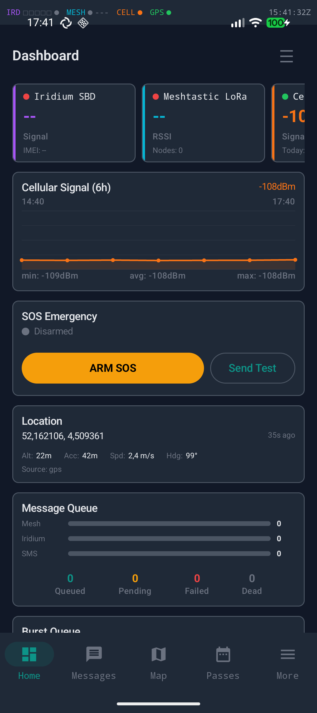
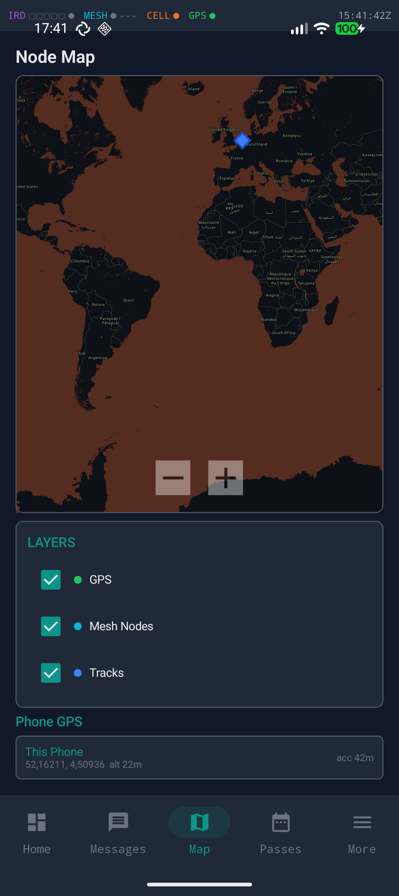
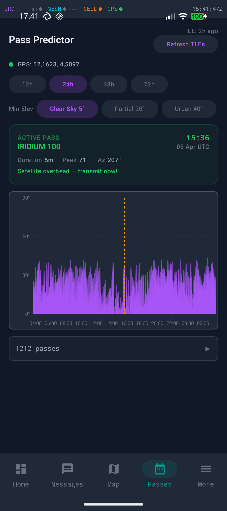
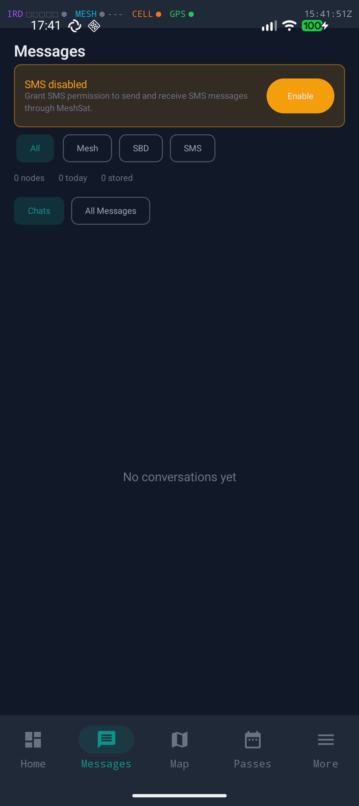
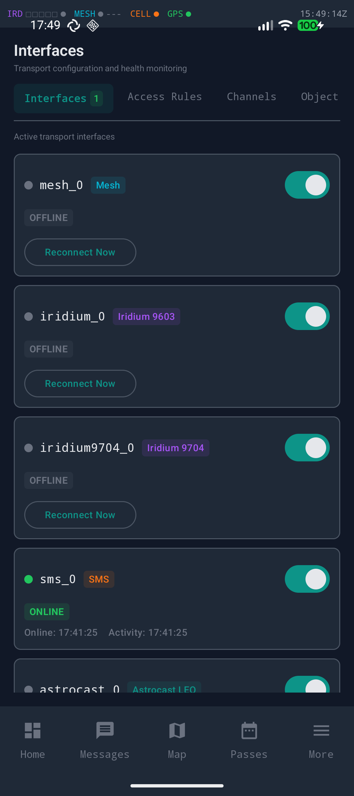
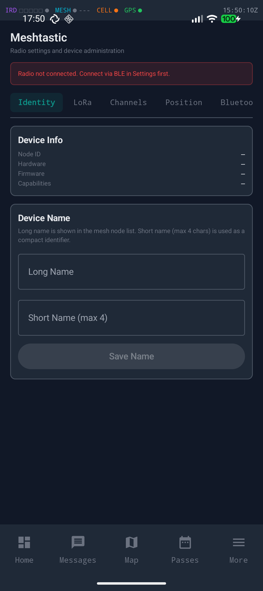
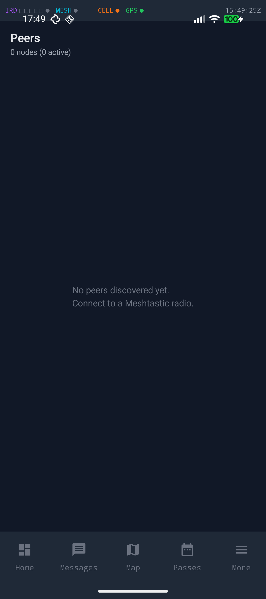
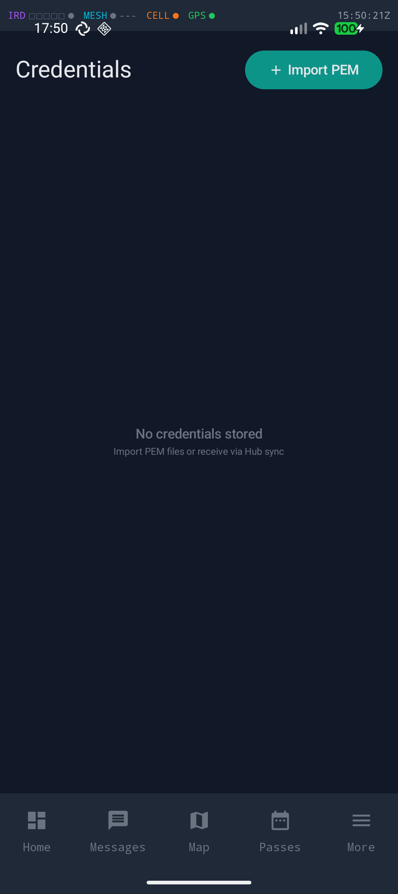
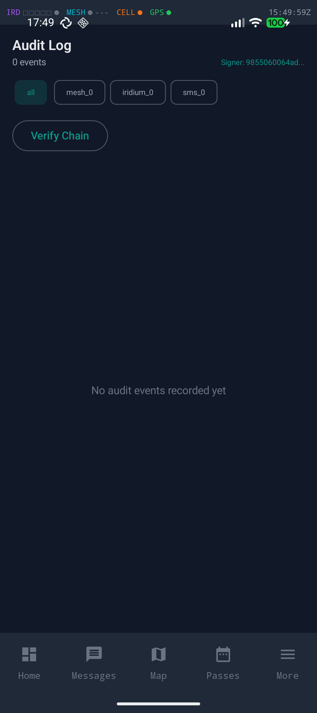

# MeshSat Android -- Standalone Mobile Gateway & Reticulum Transport Node

[](LICENSE)
[](https://github.com/cubeos-app/meshsat-android/releases)

Native Android app that turns a phone into a standalone field gateway and full Reticulum Transport Node. Bridges Meshtastic mesh (BLE), Iridium satellite (9603N SBD + 9704 IMT), Astrocast LEO, APRS, cellular SMS, and MQTT -- with end-to-end encryption, semantic compression, and intelligent routing.

The phone IS the gateway. No companion app, no server dependency, no internet required.

## Screenshots

| Dashboard | Map | Pass Predictor |
|:---------:|:---:|:--------------:|
|  |  |  |

| Messages | Interfaces | Radio Config |
|:--------:|:----------:|:------------:|
|  |  |  |

| Peers | Credentials | Audit Log |
|:-----:|:-----------:|:---------:|
|  |  |  |

## Quick Start

### End Users -- Install from GitHub Releases

1. Download the latest signed APK from [GitHub Releases](https://github.com/cubeos-app/meshsat-android/releases)
2. On your phone, enable **Settings > Security > Install unknown apps** for your browser
3. Open the downloaded `.apk` and tap **Install**
4. If Google Play Protect warns about an unknown developer, tap **Install anyway** -- the APK is signed (see [Release Signing](#release-signing) below)
5. Open MeshSat and grant the requested permissions (Bluetooth, Location, SMS, Notifications)

### Developers -- Build from Source

Requires Android SDK (compileSdk 35) and JDK 17.

```bash
git clone https://github.com/cubeos-app/meshsat-android.git
cd meshsat-android
./gradlew assembleDebug
# APK at app/build/outputs/apk/debug/app-debug.apk
```

## Setup Guide

### Step 1: Grant Permissions

On first launch, MeshSat requests permissions for Bluetooth, Location, SMS, and Notifications. All are required for full functionality:

- **Bluetooth** -- connects to Meshtastic radios (BLE) and satellite modems (HC-05 SPP)
- **Location** -- required for BLE scanning on Android 12+, GPS position for map and beaconing
- **SMS** -- enables the cellular SMS gateway transport
- **Notifications** -- foreground service notification (Android 13+ requirement)
- **Foreground service types** (Android 14+): `connectedDevice` and `location` are declared in the manifest

### Step 2: Pair Your Radio

Open **Settings** and pair your Meshtastic radio via Bluetooth. The app scans for BLE devices advertising the Meshtastic service UUID. Tap your device to connect. Full radio configuration is available in the **Radio Config** tab (7 sub-tabs: Identity, LoRa, Channels, Position, Bluetooth, Network, Admin).

For satellite modems (RockBLOCK 9603N/9704) or Astrocast, pair the HC-05 Bluetooth SPP adapter first via Android Bluetooth settings, then select it in MeshSat Settings.

### Step 3: Connect to Hub (Optional)

If you use [MeshSat Hub](https://hub.meshsat.net) for fleet management:

1. On the Hub web UI, generate a QR provisioning code for your device
2. In MeshSat, go to **Settings > Hub** and scan the QR code
3. The app auto-configures Hub URL, credentials, and mTLS certificates
4. Alternatively, paste the Hub URL and mTLS client certificate PEM manually in **Settings > Hub**

### Step 4: Configure Access Rules

Go to **Rules** to set up message routing between transports. Rules use Cisco ASA-style implicit deny with per-rule source/destination interface filtering, keyword/sender/node matching, object groups, failover groups, and rate limiting.

### Step 5: Send a Test Message

Open the **Comms** tab and send a test message to a Meshtastic node. If access rules route to a satellite interface, verify delivery in the **Delivery Ledger** (Rules > DLQ tab). Check the Dashboard sparklines for real-time activity.

## Transports

| Transport | Connection | Protocol | MTU |
|-----------|-----------|----------|-----|
| **Meshtastic** | Bluetooth LE | Official protobuf (15 portnums) | 237B |
| **Iridium 9603N** | HC-05 Bluetooth SPP | AT/SBD (19200 baud) | 340B |
| **Iridium 9704** | HC-05 Bluetooth SPP | JSPR (230400 baud, 100KB msgs) | 100KB |
| **Astrocast** | HC-05 Bluetooth SPP | Astronode S (auto-fragmentation) | 636B |
| **APRS** | KISS TNC + APRS-IS | AX.25 / APRS-IS TCP | 256B |
| **SMS** | Native Android | AES-GCM encrypted, MSVQ-SC compressed | 160B |
| **MQTT** | WiFi/cellular | Eclipse Paho (mTLS) | -- |

## Architecture

```
Phone (MeshSat Android)
 |
 +-- BLE ----------------> Meshtastic radio (15 portnums, full radio config)
 |
 +-- Bluetooth SPP ------> HC-05 --> RockBLOCK 9603N (Iridium SBD)
 |                      +-> HC-05 --> RockBLOCK 9704  (Iridium IMT/JSPR)
 |                      +-> HC-05 --> Astronode S      (Astrocast LEO)
 |
 +-- KISS TNC -----------> APRS radio (smart beaconing, directed messaging)
 +-- APRS-IS TCP --------> APRS internet gateway
 |
 +-- Native SMS ---------> Cellular (AES-GCM + MSVQ-SC compression)
 |
 +-- MQTT (mTLS) --------> MeshSat Hub (telemetry, commands, credentials)
 |
 +-- Reticulum TCP (TLS)-> reticulum.meshsat.net (Transport Node mesh)
 |
 +-- Dispatcher ---------> Per-interface workers, fan-out, dedup, TTL
 +-- AccessEvaluator ----> Cisco ASA-style ACL rules, keyword/sender filters
 +-- FailoverResolver ---> Priority-based transport failover groups
 +-- InterfaceManager ---> 5-state machine, exponential backoff reconnect
 +-- TransformPipeline --> compress -> encrypt -> base64 (per-interface)
 +-- BurstQueue ---------> TLV-pack multiple messages into one SBD (max 340B)
 +-- PassScheduler ------> 4-mode satellite scheduling (Idle/PreWake/Active/PostPass)
 +-- CreditTracker ------> Per-message Iridium cost tracking ($0.05/MO)
 +-- HealthScorer -------> Composite 0-100 per interface (signal/success/latency/cost)
```

## Android vs Bridge Parity

| Capability | Bridge (Pi/Linux) | Android |
|---|---|---|
| Meshtastic | Serial/USB | BLE |
| Iridium 9603N SBD | UART/USB | HC-05 Bluetooth SPP |
| Iridium 9704 IMT | FTDI USB | HC-05 Bluetooth SPP |
| Astrocast LEO | USB serial | HC-05 Bluetooth SPP |
| Cellular SMS | USB AT modem | Native Android SMS |
| ZigBee | USB dongle (Z-Stack ZNP) | -- |
| APRS | Direwolf KISS TNC | KISS TNC + APRS-IS |
| TAK gateway (CoT XML server) | Full server + client | Receive-only (Hub broadcast) |
| Webhooks | Outbound HTTP | -- |
| HeMB bonding (RLNC) | Production (multi-bearer) | -- |
| Dead Man Switch | Yes | Yes |
| Geofence Monitor | Yes | Yes |
| Hub client (mTLS + 8 commands) | Yes | Yes |
| Reticulum Transport Node | 10 interfaces | 10+ interfaces |
| Multi-instance transports | Yes | Yes (TransportRegistry) |
| Delivery ledger + DLQ | Yes | Yes (10 status states) |
| Access rules + object groups | Yes | Yes |
| QR key bundles | Yes | Yes (`meshsat://key/` URI) |
| Master key envelope encryption | Yes | Yes (EncryptedSharedPreferences) |
| Ed25519 audit log chain | Yes | Yes |
| Config export/import (YAML) | Yes | Yes (Bridge-compatible) |
| Satellite pass predictor (SGP4) | Yes | Yes (Canvas bezier arcs) |
| Iridium credit tracking | Yes | Yes |
| Web dashboard | Vue.js SPA (13 views) | Jetpack Compose (14 screens) |
| REST API | 280+ endpoints | 14 endpoints (localhost:6051) |
| Runs without infrastructure | Needs Pi + power | Phone only |

## Reticulum Transport Node

MeshSat Android is a full Reticulum Transport Node -- not just a client. It relays packets between all interfaces, maintains a forwarding table with cost-aware routing, and announces itself to the mesh.

- **Ed25519 signing + X25519 encryption** identity
- **10+ Reticulum interfaces**: Meshtastic BLE, Iridium 9603, Iridium 9704, Astrocast, SMS, MQTT, TCP (HDLC), BLE peripheral (GATT server), Tor (SOCKS5), WireGuard
- **Cross-interface relay** with announce propagation and hop counting
- **3-packet ECDH link handshake** with AES-256-GCM encrypted links
- **Path table** with cost-aware forwarding and path request/response
- **TLS + mTLS** for authenticated TCP tunnel to Hub

## Meshtastic Integration

Full radio configuration via BLE (not just messaging):

- **15 portnums**: text, position, telemetry, routing ACK/NAK, waypoint, neighborinfo, traceroute, store-forward, range test, detection sensor, paxcounter, reply, nodeinfo, admin, private
- **7 config tabs**: Identity, LoRa (region/preset/TX power/hop limit), Channels (8 with PSK), Position (GPS/broadcast interval), Bluetooth, Network (WiFi), Admin (reboot/shutdown/factory reset)
- **Official protobuf bindings** from `meshtastic/protobufs` via `protobuf-javalite`

## Security & Encryption

### Crypto

- **AES-256-GCM** per-conversation encryption for SMS
- **MSVQ-SC** lossy semantic compression (~92% savings) -- ONNX Runtime INT8 encoder (TX), pure Kotlin codebook decoder (RX)
- **Ed25519 hash-chain audit log** -- append-only, tamper-evident, viewable in the Audit screen with chain verification
- **ECDSA-P256 signed birth messages** for Hub device verification

### Master Key Envelope

Device-level at-rest encryption using Android's `EncryptedSharedPreferences` (AndroidX Security). All sensitive keys and credentials are wrapped with HKDF + AES-256-GCM key wrapping backed by the Android Keystore hardware.

### QR Key Bundles

Cross-platform key exchange via `meshsat://key/` URI scheme. Scan a QR code from Bridge or another Android device to import conversation keys, transport credentials, and Hub certificates. The `KeyBundleImporter` validates, decodes, and stores key material with TOFU (Trust On First Use) pinning.

### Credential Management

The **Credentials** screen provides:
- PEM certificate import (paste or file picker) for Hub mTLS client certificates
- Certificate expiry monitoring with dashboard warnings
- Hub-distributed credential push/revoke via MQTT commands
- Encrypted storage of all certificate material

### Release Signing

All release builds (v2.8.0+) are signed via OpenBao secret management:
- **Keystore**: PKCS12, RSA 2048, stored in OpenBao vault
- **Upload key alias**: `meshsat-upload`
- **Verification**: `apksigner verify --print-certs meshsat-v*.apk`
- CI pipeline fetches signing credentials via GitLab JWT -> OpenBao auth -> signed APK + AAB

Debug builds use the Android debug keystore and are not suitable for production.

## TAK / CoT Integration

MeshSat Android receives TAK Cursor on Target (CoT) position data from Hub via MQTT broadcast topic `meshsat/broadcast/tak/cot/in`. Incoming CoT XML is parsed and rendered as diamond markers on the osmdroid map alongside local Meshtastic nodes. This enables situational awareness of TAK-connected assets without running a full ATAK client on the phone.

TAK gateway (CoT XML server mode) is Bridge-only. Android is receive-only via Hub broadcast.

## Delivery Ledger & DLQ

Every outbound message is tracked in the `MessageDeliveryEntity` table with 10 status states: `queued`, `pending`, `sending`, `sent`, `delivered`, `failed`, `expired`, `cancelled`, `retrying`, `dead_letter`. The Rules screen includes a **DLQ Inspector** tab showing failed deliveries with retry controls and status history.

## Multi-Instance Transports

The `TransportRegistry` supports multiple instances of the same transport type (e.g., two HC-05 adapters for 9603N + 9704 simultaneously). Each instance has independent config, delivery workers, and health tracking. Backward compatible with singleton accessor patterns.

## Local REST API

NanoHTTPD server on `localhost:6051` with 14 endpoints:

| Category | Endpoints |
|----------|-----------|
| **System** | `GET /api/status`, `POST /api/system/restart` |
| **Settings** | `GET/POST /api/settings`, `GET/POST /api/settings/hub` |
| **Messages** | `GET /api/messages`, `POST /api/messages/send` |
| **Hub** | `GET /api/hub/status`, `POST /api/hub/connect` |
| **Transports** | `GET /api/interfaces`, `GET /api/interfaces/:id/health` |
| **Config** | `GET /api/config/export`, `POST /api/config/import` |
| **Audit** | `GET /api/audit/log` |

## Field Intelligence

- **Dead Man Switch** -- auto-SOS after configurable inactivity timeout (default 4h)
- **Geofence Monitor** -- polygon zones with ray-casting, enter/exit events
- **Canned Codebook** -- 30 military brevity messages, 2-byte wire format
- **Position Codec** -- 16-byte full frame + 11-byte delta frame with DeltaEncoder
- **Smart APRS beaconing** -- corner-pegging algorithm adjusts beacon rate to movement

## Hub Integration

Connects to MeshSat Hub for centralized fleet management:

- **HubReporter** -- health telemetry, signed birth certificates, position updates
- **8 Hub commands**: ping, send_text, send_mt, flush_burst, config_update, reboot, credential_push, credential_revoke
- **mTLS client certificates** -- PEM import in Credentials screen
- **QR provisioning** -- scan Hub QR code to auto-configure all settings

## UI

Jetpack Compose Material 3 dark theme with 14 screens:

- **Reorderable dashboard** -- sparklines, SOS button, location, queue depth, burst queue, activity log, Reticulum widget, credit gauge, mailbox check
- **Comms screen** -- message tabs with send/receive
- **Peers table** -- mesh node list with signal, position, last seen
- **Native map** -- osmdroid with markers, track lines, GPS accuracy circle, node filters, offline MBTiles support, TAK diamond markers
- **Pass predictor** -- SGP4 orbital mechanics, TLE fetch, Canvas bezier elevation arcs, countdown
- **Interface management** -- transport status cards, channel list, health tabs
- **Rules editor** -- ACL rules, DLQ inspector, object groups, failover groups
- **Audit log** -- Ed25519-signed entries with chain verification
- **Credentials** -- certificate management with PEM import, expiry monitoring
- **Full settings** -- all transports, routing config, announce intervals, mTLS, dead man switch, restart
- **Radio config** -- 7-tab Meshtastic device configuration
- **Mesh topology** -- network topology stats and SNR visualization

## Requirements

- **Android 8.0+** (API 26), tested up to **Android 16** (API 36)
- Bluetooth LE (for Meshtastic radios)
- SMS permission (for cellular gateway)
- Location permission (for GPS and BLE scanning on Android 12+)
- Notification permission (Android 13+, for foreground service)
- `FOREGROUND_SERVICE_CONNECTED_DEVICE` + `FOREGROUND_SERVICE_LOCATION` (Android 14+, declared in manifest)
- ~35 MB free storage for ONNX model assets
- ~150 MB RAM overhead (ONNX Runtime cold start ~500ms on first compression call)

## Supported Devices

### Phones (Tested)

| Device | Android | Status | Notes |
|--------|---------|--------|-------|
| Google Pixel 9a | 16 (API 36) | Tested | Primary test device, BouncyCastle/Conscrypt verified |
| Google Pixel 9 | 16 (API 36) | Tested | Android 16 compatibility verified |
| Samsung Galaxy S23 | 14 (API 34) | Tested | Foreground service types verified |
| Android Emulator (API 30) | 11 (API 30) | Tested | CI/map testing (nllei01androidsdk01) |

### Radios & Modems

| Category | Device | Connection | Status | Notes |
|----------|--------|-----------|--------|-------|
| **Meshtastic** | Lilygo T-Echo (nRF52840) | BLE | Tested | 915 MHz, e-ink display |
| | Lilygo T-Deck | BLE | Tested | ESP32-S3, keyboard, screen |
| | Heltec LoRa V4 (ESP32-S3 + SX1262) | BLE | Tested | 868/915 MHz, OLED, GPS |
| | XIAO ESP32-S3 + SX1262 | BLE | Tested | Ultra-compact |
| | Any Meshtastic BLE device | BLE | Should work | Standard Meshtastic service UUID |
| **Satellite** | RockBLOCK 9603 (Iridium 9603N) | HC-05 SPP (19200) | Tested | SBD, 340B MO, $0.05/msg |
| | RockBLOCK 9704 (Iridium IMT) | HC-05 SPP (230400) | To Verify | JSPR, 100KB msgs |
| | Astrocast Astronode S | HC-05 SPP | To Verify | Auto-fragmentation, 636B |
| **APRS** | Quansheng UV-K5 | KISS TNC | Tested | Via AIOC audio interface |
| | Any Direwolf-compatible TNC | KISS TNC | Should work | |
| **Bluetooth adapter** | HC-05 | SPP | Tested | Set baud rate before use |

## Troubleshooting

### Bluetooth / BLE

**Can't find Meshtastic radio during scan** -- Ensure Location permission is granted (required for BLE scanning on Android 12+). Check that the radio's Bluetooth is enabled and advertising. Try toggling Bluetooth off/on.

**BLE connects but disconnects immediately** -- Some Android OEMs aggressively kill background services. Add MeshSat to your battery optimization whitelist: Settings > Apps > MeshSat > Battery > Unrestricted.

**HC-05 SPP not pairing** -- Pair the HC-05 adapter in Android Bluetooth settings first (default PIN: 1234), then select it in MeshSat Settings. Ensure the HC-05 baud rate matches the modem (19200 for 9603N, 230400 for 9704).

### Foreground Service

**"MeshSat keeps stopping" on MIUI/OPPO/Samsung** -- These OEMs kill foreground services aggressively. Enable auto-start: Settings > Apps > MeshSat > Auto-start. On MIUI, also disable battery saver for MeshSat. See [dontkillmyapp.com](https://dontkillmyapp.com) for device-specific instructions.

**Notification permission denied** -- On Android 13+, the foreground service notification requires explicit permission. Go to Settings > Apps > MeshSat > Notifications and enable.

### Play Protect / Sideloading

**"Blocked by Play Protect"** -- Tap **More details > Install anyway**. The APK is signed with our release key but not distributed via Play Store, so Play Protect flags it as unknown. Verify the signature: `apksigner verify --print-certs meshsat-*.apk`.

**"App not installed" error** -- Check that you have enough storage space (~85 MB for app + assets). If upgrading, ensure the new APK is signed with the same key as the installed version. Uninstall the old version first if signatures don't match.

### Satellite

**Iridium signal shows 0 bars** -- Ensure the HC-05 is paired and selected. Check antenna connections on the RockBLOCK. Requires clear sky view for signal acquisition.

**Messages stuck in "sending" state** -- Check the Delivery Ledger (Rules > DLQ tab). Iridium SBD requires a satellite pass. The PassScheduler will auto-flush the burst queue during the next predicted pass.

### Map

**Map tiles not loading (blank map)** -- On Android 16, ensure you're running v2.8.2+ which fixes a BouncyCastle/Conscrypt provider conflict that silently broke HTTPS tile downloads. If offline, osmdroid uses cached tiles from previous sessions.

### Performance

**First message compression is slow (~500ms)** -- This is the ONNX Runtime cold start. Subsequent compressions are fast. The encoder session is initialized lazily on first use.

## Changelog

### v2.8.x (Current)

- **v2.8.5** -- TOFU key pinning in KeyBundleImporter, bundle v2 format (MESHSAT-495). Transport I/O state gating (MESHSAT-499)
- **v2.8.4** -- Version bump
- **v2.8.3** -- Fix PassScheduler OOM: ms/sec unit mismatch causing 1000x propagation loop (MESHSAT-498). Verified on Pixel 9a Android 16
- **v2.8.2** -- Fix BouncyCastle JCA provider ordering breaking Conscrypt SSL on Android 16 (MESHSAT-497). Restored HTTPS for map tiles, Hub TLS, mTLS
- **v2.8.1** -- osmdroid R8 keep rules (MESHSAT-493)
- **v2.8.0** -- Release signing with OpenBao + Play Store AAB (MESHSAT-492)

### v2.7.x

- TAK CoT reception via Hub MQTT broadcast
- APRS KISS TNC + APRS-IS + smart beaconing

### v2.0.x -- v2.6.x

- Full Bridge feature parity (16 gaps closed, MESHSAT-385)
- Reticulum Transport Node (10+ interfaces, Ed25519 identity, cross-interface relay)
- GUI clone from Pi dashboard (Phases M-P)
- Satellite pass predictor (SGP4, Canvas bezier arcs)

### v1.x

- Initial Android parity (Phases A-G, MESHSAT-57)
- Core transports: BLE Meshtastic, Iridium SPP, SMS, MQTT
- MSVQ-SC compression, AES-GCM encryption
- Field intelligence (dead man switch, geofence, health scores)

For detailed release notes, see [GitHub Releases](https://github.com/cubeos-app/meshsat-android/releases).

## Config Management

JSON + YAML export/import (Bridge-compatible `show run`-style), validate, diff preview.

## Data Layer

Room database (schema v10) with 12 entities: Messages, SignalRecord, NodePosition, ForwardingRuleEntity, ConversationKey, AccessRuleEntity, ObjectGroupEntity, FailoverGroupEntity, MessageDeliveryEntity, AuditLogEntity, RnsTcpPeer, IridiumCreditEntry.

DataStore for all settings including encryption keys, transport config, routing parameters, mTLS certificates, and dashboard layout.

## Tech Stack

| Component | Library | Version |
|-----------|---------|---------|
| Language | Kotlin | 1.9.x |
| UI | Jetpack Compose (Material 3) | BOM 2024.x |
| Database | Room (SQLite, schema v10) | 2.6.x |
| Settings | DataStore Preferences | 1.1.x |
| Secure storage | EncryptedSharedPreferences (AndroidX Security) | 1.1.0-alpha06 |
| ML Runtime | ONNX Runtime Android (INT8 quantized) | 1.16.x |
| Map | osmdroid (native OpenStreetMap) | 6.1.x |
| MQTT | Eclipse Paho | 1.2.5 |
| Protobuf | protobuf-javalite (Meshtastic bindings) | 3.25.x |
| HTTP server | NanoHTTPD | 2.3.1 |
| QR scanning | ZXing Android Embedded | 4.3.x |
| Crypto | BouncyCastle (Ed25519/X25519 JCA provider) | 1.78 |
| Concurrency | Kotlin Coroutines | 1.8.x |

## Assets (~35MB)

| File | Size | Purpose |
|------|------|---------|
| `encoder.onnx` | 22MB | INT8 quantized MSVQ-SC sentence encoder |
| `codebook_v1.bin` | 12MB | ResidualVQ codebook vectors |
| `corpus_index.bin` | 70KB | Nearest-neighbor decode corpus |
| `vocab.txt` | 230KB | WordPiece vocabulary (30,522 tokens) |

## Related Projects

- [MeshSat Bridge](https://github.com/cubeos-app/meshsat) -- Go gateway for Raspberry Pi / Linux (same transport suite, USB devices)
- [MeshSat Hub](https://hub.meshsat.net) -- Multi-tenant SaaS fleet management platform
- [MeshSat Website](https://meshsat.net) -- Documentation, install scripts, getting started guide
- [CubeOS](https://cubeos.app) -- Self-hosted OS for SBCs and edge devices

## Community

- GitHub: [github.com/cubeos-app/meshsat-android](https://github.com/cubeos-app/meshsat-android)
- Issues: Use GitHub Issues for bugs and feature requests
- Website: [meshsat.net](https://meshsat.net)

PRs welcome. See open issues for where help is needed.

## Contributing

1. Fork the repository
2. Create a feature branch
3. Run tests: `./gradlew testDebugUnitTest` (~400 unit tests)
4. Submit a pull request

## License

Copyright 2026 Nuclear Lighters Inc. Licensed under the [Apache License 2.0](LICENSE).
